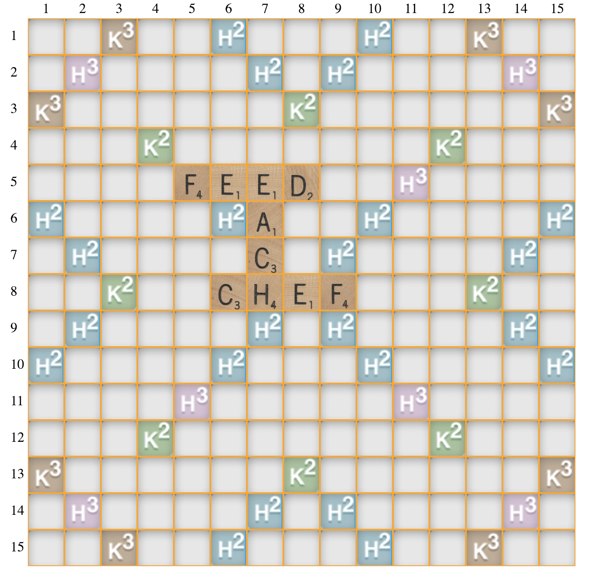
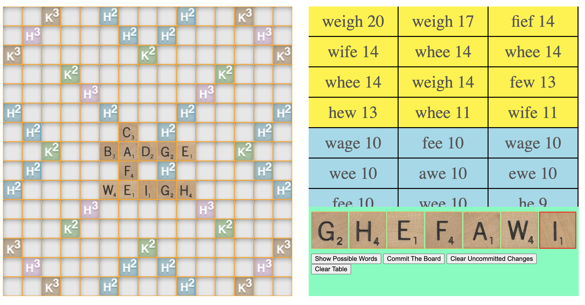

# Scrabble Word Finder


This is a web application which can be used to see possible moves on a Scrabble game considering the letters in hand and the state of the game board.

## Credits

The letter tiles are taken from [**http://www.fuzzimo.com/free-hi-res-wooden-scrabble-letter-tiles/**](#http://www.fuzzimo.com/free-hi-res-wooden-scrabble-letter-tiles/)

## Usage

For each language there is a subfolder in the root folder. Currently, as the only language is English, there is only one folder (en).

To run the application, just execute en/index.html. The screen will be the following:

<p align="center"></p>

Here, K2, K3, H2 and H3 are signs of special cells. K2 cells give double point for the written word, K3 give triple point, H2 gives double point to the letter that passes by it and H3 gives triple point for the letter. Those images will be fixed in the future.

Letters can be added to the game board by clicking to a cell on the board (the border of the cell will turn into red) and then pressing a letter on the keyboard. Also, after clicking to a cell arrow keys can be used to select another cell. Pressing delete button will remove the letter that is added to cell. You can see below an example of how it looks like after adding letters to the game board. 

<p align="center"></p>

After putting the game board in a desired state, click "Commit The Board" button. This will save the newly added letters into memory so when it will compute the possible moves it will take those letters into account. After commiting, the cells which contain a letter cannot be modified.

Now, we need to enter the letters in our hand. The seven empty boxes on top of the buttons are for that purpose. You can put letters the same way you added letters to the game board (you don't have to put 7 letters there can be some empty boxes as well). After doing that, press "Show Possible Words". It will compute all possible moves considering the game board and the letters in hand and output the suggestions on the top right of the screen. This is a screenshot of how it looks like:

<p align="center"></p>

Note that the words that are suggested might be weird. If it is the case, it is because of the English words list that has been used in the application. Changing the words' list will fix the problem. The way to do this will be explained in the [**Customization section**](#customization-section). 

Clicking to any of those suggestions will result in application putting the letters on the game board, so you can see how to play this suggested move. Clicking to another suggestion after that would cause the letters put for the first suggestion to be removed on the game board. After finding a good move to play, just be sure that the game board is in the correct state, press "Commit The Board" button and update the letters on your hand.


## <a name="customization-section"></a>Customization

For this application, the word list can be changed. To do that, edit en/wordlist.txt and then run the following command (Python must be installed on your computer to run it):

```
python wordlist_transformer.py
```

The images can be modified as well. They are stored at en/visual and script/configuration.js keeps the data on how to use those images. By modifying configuration.js and adding/removing/editing files in en/visual folder, the images can be changed easily.


Also the following properties can be modified:

<ul>
<li>Game board size</li>
<li>The number of letters that a player can hold</li>
<li>The points of each letter</li>
<li>Special cells in the board</li>
</ul>

Those properties are kept in script/configuration.js as well, so they can be changed by editing this file.


